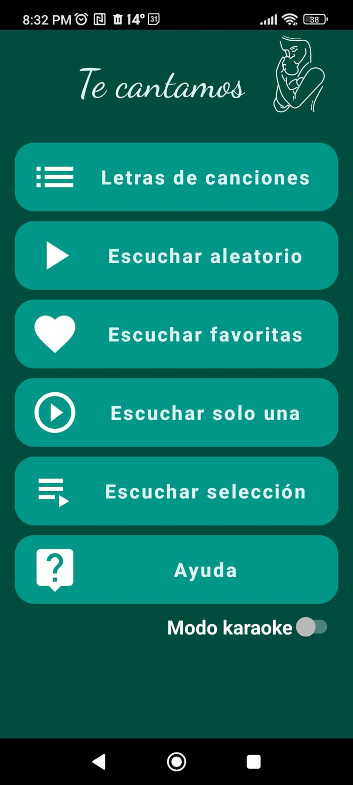
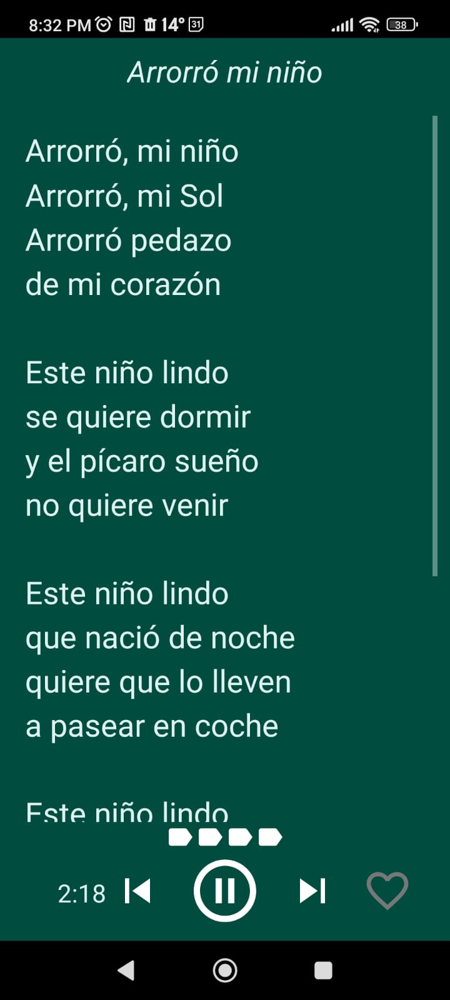

# Te cantamos

## Capturas de pantalla

## Ayuda

Esta guía te ayudará a prepararte para disfrutar más de las canciones que vas a cantarle a tu bebé.

Voy a pedirte que cierres los ojos un minuto y sientas tu cuerpo. Siente tus pies y cómo están apoyados en el suelo.

¿Cómo estás en el espacio? ¿Dónde está tenso? ¿Dónde está relajado?

Intentá aflojar tus hombros y cuello. Abrí dos veces tu boca como si fueras a bostezar. Respirá profundo tres veces.

Ahora escucha los sonidos que hay a tu alrededor. Prestá atención a los sonidos que están más cerca de vos. De a poco, empezá a escuchar tus sonidos, tu respiración, tu corazón...

Abrí tus ojos, mirá a tu bebé y para terminar, otra vez respirá profundo tres veces.

Disfrutá tu música!

## Descarga

Descargar aplicación para Android [aquí](https://github.com/santiago-iturriaga/te_cantamos/blob/13ff6d18f9966bddfb3865be8c3744f978275f94/te_cantamos/release/te_cantamos-release.apk)
